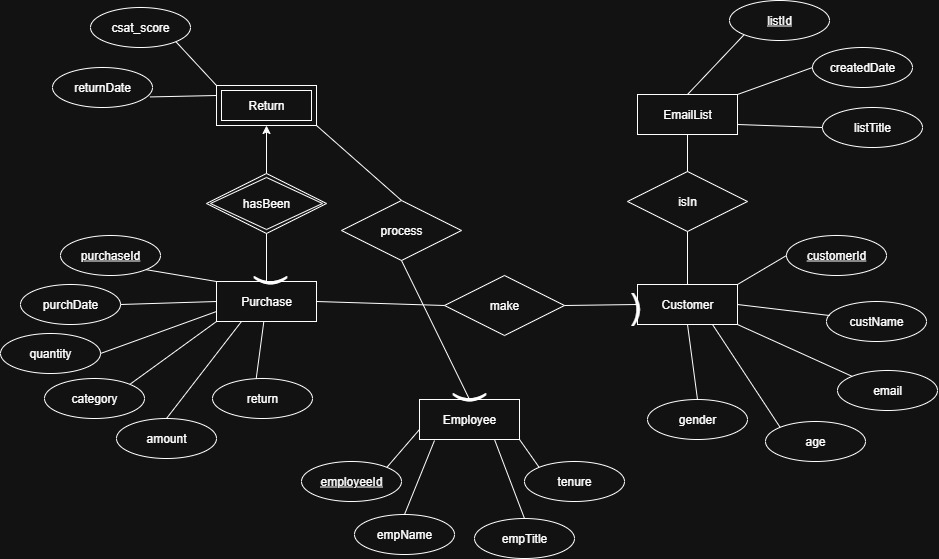

# Database Design

## Entity-Relationship Diagram

## Design Specifics
In this ER diagram, we have a total of 5 entities (4 strong, weak), each corresponding to their
own attributes and relationships.
  - Starting off, we have a Customer entity that represents each customer. Each customer
has a unique CustomerId in addition to their email, custName, age, and gender for the company
to see.
  - We also have an EmailList entity. Each email list has a unique listId in addition to their
createdDate and listTitle.
  - We have an Employee entity that represents each employee in the company. Each
employee has a unique employeeId in addition to their tenure, empName, and empTitle.
  - We have a purchase entity, which represents purchase(s) made by a customer. Each
purchase has a unique purchaseId, along with the date of said purchase, quantity, category,
amount, and if returned (yes/no). Each purchase that has been returned has a date of when the
return was made and a csat_score, customer satisfaction score.

Relations & Explanations
  - Each Customer is in multiple EmailList meanwhile each EmailList contains multiple
customers.
    - A customer can be in zero to multiple email lists depending if they meet multiple
requirements for different email lists we create. Since every individual email list does contain its
own requirements for customers it’s looking to market. Obviously, an email list can have
anywhere from zero to multiple customers depending on who meets the requirements.
  - Each Customer can make multiple purchases, and each purchase is made by exactly
one customer.
    - A customer is not limited to a number of purchases, therefore they can make
zero to multiple. When it comes to the purchase, the transaction itself is made by only one
customer.
  - Each Employee can process many returns while each return is processed by exactly
one employee.
    - As an employee, they are supposed to process zero to multiple returns, but a
return should only have to be processed by one employee instead of multiple.
  - Each Purchase at most has been returned once. Each return belongs to exactly one
purchase.
    - A purchase is technically allowed to only be returned at most once. If said
purchase was bought, returned, then bought again then we are now looking at two different
purchases instead of the same one, therefore it’s not possible for a purchase to be returned
more than once. As for each return, it corresponds to exactly one purchase.

Explanations for Entities:
  - This diagram represents the relationship a purchase, customer, employee, email list,
and return all have and how they’re all connected. We chose these 5 entities to represent our
overall database as they altogether provide the company with enough information needed to
improve product quality and customer satisfaction.

## Normalization

Functional Dependencies

Customer
customerId → custName, age, gender, email

Employee
employeeId → empName, empTitle, tenure

Purchase
purchaseId → customerId, purchDate, category, quantity, amount

Return
returnId → purchaseId, employeeId, returnDate, csat_score
purchaseId → returnId

EmailList
listId → listTitle, createdDate

This schema is already normalized because we designed the relationships to avoid redundancy from the start. We gave 
each fact its own table with a clear key. Anything that would create overlap or redunduncies was split out. In particular, 
we moved dependent details into their own weak entity, like Return lives in a seperate dependent table; so those attributes 
depend only on the right key. Every non-key attribute depends on the key, satisfying BCNF without further decomposition.

## Logical Design
