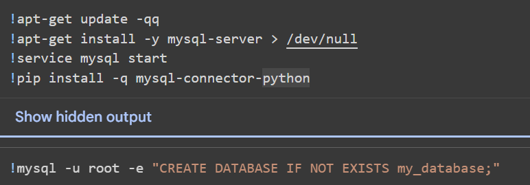
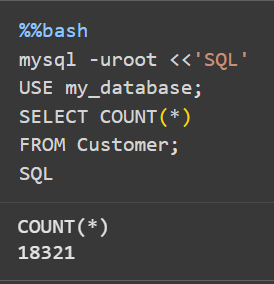
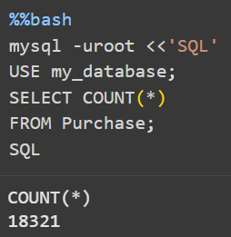
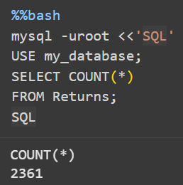
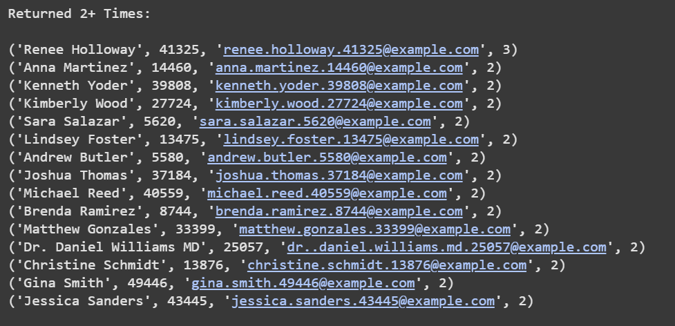
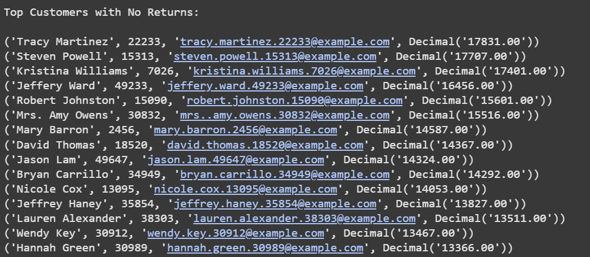
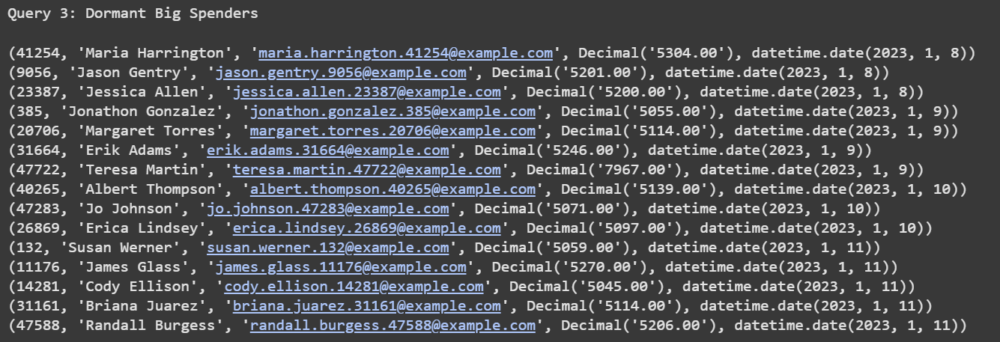
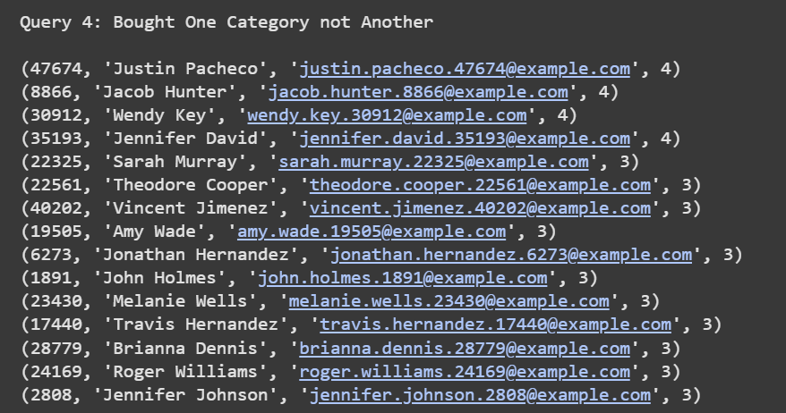

# Database Implementation and Indexing
Link to Google Colab notebook with implementation: https://colab.research.google.com/drive/1qb38Cc8UghqK9IwmKuiNFOEutGq56bTF?usp=sharing

## Implementation
1. Since we are working on Google Colab, the database is run on an individual virtual machine that refeshes every time the notebook is closed or surpasses
   the runtime constraints. Because of this, each time we open the notebook we must run the following commands to redownload and start mySQL along with the database.



2. Following are the Database Design Language (DDL) commands we used to implement our 5 entity tables and our 1 relationship table. The ENGINE and DEFAULT CHARSET
   specifications for each table guarantee that foreign key constrainsts and all characters are valid when mySQL creates the tables.

#### Customer Table
```
  CREATE TABLE IF NOT EXISTS Customer (  
  customerId INT PRIMARY KEY,  
  email VARCHAR(255) NOT NULL UNIQUE,  
  custName VARCHAR(100) NOT NULL,  
  age INT CHECK (age >= 0),  
  gender VARCHAR(20)  
) ENGINE=InnoDB DEFAULT CHARSET=utf8mb4;   
```
#### Email List Table
```
CREATE TABLE IF NOT EXISTS EmailList (  
  listId INT PRIMARY KEY,  
  listTitle VARCHAR(120) NOT NULL UNIQUE,  
  createdDate DATE NOT NULL  
) ENGINE=InnoDB DEFAULT CHARSET=utf8mb4;  
```
#### Customer-Email List Relationship Table
```
CREATE TABLE IF NOT EXISTS CustomerEmailList (  
  customerId INT NOT NULL,  
  listId INT NOT NULL,  
  PRIMARY KEY (customerId, listId),  
  FOREIGN KEY (customerId) REFERENCES Customer(customerId)  
    ON UPDATE CASCADE ON DELETE CASCADE,  
  FOREIGN KEY (listId) REFERENCES EmailList(listId)  
    ON UPDATE CASCADE ON DELETE CASCADE  
) ENGINE=InnoDB DEFAULT CHARSET=utf8mb4;  
```
#### Employee Table 
```
CREATE TABLE IF NOT EXISTS Employee (  
  employeeId INT PRIMARY KEY,  
  empName VARCHAR(100) NOT NULL,  
  empTitle VARCHAR(100),  
  tenure VARCHAR(225)
) ENGINE=InnoDB DEFAULT CHARSET=utf8mb4;  
```
#### Purchase Table
```
CREATE TABLE IF NOT EXISTS Purchase (  
  purchaseId INT PRIMARY KEY,  
  customerId INT NOT NULL,  
  purchDate DATE NOT NULL,  
  quantity INT NOT NULL CHECK (quantity > 0),  
  category VARCHAR(50) NOT NULL,  
  amount DECIMAL(10,2) NOT NULL CHECK (amount >= 0),  
  returned BOOLEAN NOT NULL DEFAULT FALSE,  
  FOREIGN KEY (customerId) REFERENCES Customer(customerId)  
    ON UPDATE CASCADE  
) ENGINE=InnoDB DEFAULT CHARSET=utf8mb4;  
```
#### Returns Table
```
CREATE TABLE IF NOT EXISTS Returns (  
  returnId INT PRIMARY KEY,  
  purchaseId INT NOT NULL UNIQUE,  
  employeeId INT NOT NULL,   
  returnDate DATE NOT NULL,  
  csat_score DECIMAL(3,2) CHECK (csat_score >= 0 AND csat_score <= 5),  
  CONSTRAINT fk_returns_purchase  
    FOREIGN KEY (purchaseId) REFERENCES Purchase(purchaseId)  
    ON UPDATE CASCADE,  
  CONSTRAINT fk_returns_employee  
    FOREIGN KEY (employeeId) REFERENCES Employee(employeeId)  
    ON UPDATE CASCADE  
) ENGINE=InnoDB DEFAULT CHARSET=utf8mb4;  
```
3. The three tables that have more than 1000 entries are Customer, Purchase, and Returns. The count queries for those tables are in the screenshots below.

  

  

  

## Advanced Queries
We have decided to focus our advanced queries on our marketing email list creation, which will make lists of customers and 
their emails based on different criteria. Below are the individual commands and the first 15 outputs.
#### Query 1: Select customers who have returned 2 or more purchases
```
SELECT c.custName, c.customerId, c.email, COUNT(r.returnId) as total_returns
FROM Customer c JOIN Purchase p ON c.customerId = p.customerId
JOIN Returns r ON p.purchaseId = r.purchaseId
GROUP BY c.custName, c.customerId, c.email
HAVING COUNT(r.returnId) >= 2
ORDER BY total_returns DESC
LIMIT 15;
```

#### Query 2: Select top spending customers who have never returned a purchase
```
SELECT c.custName, c.customerId, c.email, SUM(p.amount) as total_spent
FROM Customer c JOIN Purchase p ON c.customerId = p.customerId
WHERE NOT EXISTS (
    SELECT 1
    FROM Returns r
    WHERE p.purchaseId = r.purchaseId
)
GROUP BY c.custName, c.customerId, c.email
ORDER BY total_spent DESC
LIMIT 15;
```

#### Query 3: Select top spending customers who have not purchased in a certain amount of days
```
SELECT
  c.customerId,
  c.custName AS customer_name,
  c.email AS customer_email,
  SUM(p.amount) AS lifetime_spend,
  MAX(p.purchDate) AS last_purchase_date
FROM Customer AS c
JOIN Purchase AS p ON p.customerId = c.customerId
WHERE NOT EXISTS (
  SELECT 1
  FROM Purchase AS p2
  WHERE p2.customerId = c.customerId
    AND p2.purchDate >= DATE_SUB(CURDATE(), INTERVAL 180 DAY)
)
GROUP BY c.customerId, c.custName, c.email
HAVING SUM(p.amount) >= 5000
ORDER BY last_purchase_date ASC
LIMIT 15;
```

#### Query 4: Select customers who have purchased products in one category but not another
```
SELECT
  c.customerId,
  c.custName AS customer_name,
  c.email AS customer_email,
  COUNT(*) AS primary_orders_without_accessory_30d
FROM Customer AS c
JOIN Purchase AS pA ON pA.customerId = c.customerId
WHERE pA.category = 'electronics'
  AND NOT EXISTS (
    SELECT 1
    FROM Purchase AS pB
    WHERE pB.customerId = c.customerId
      AND pB.category = 'books'
      AND pB.purchDate BETWEEN pA.purchDate AND DATE_ADD(pA.purchDate, INTERVAL 30 DAY)
  )
GROUP BY c.customerId, c.custName, c.email
ORDER BY primary_orders_without_accessory_30d DESC
LIMIT 15;
```
 

## Indexing
### Methodology
We tested four advanced queries against three different indexing configurations to measure performance improvements. For each configuration, we used the `EXPLAIN ANALYZE` command to measure query execution cost.

### Index Configurations Tested
1. **Baseline**: No additional indexes (only primary keys)
2. **Config 1**: Index on `Purchase.customerId`
3. **Config 2**: Index on `Returns.purchaseId`
4. **Config 3**: Both indexes combined

### Results

#### Baseline (No Additional Indexes)
| Query | Cost | Description |
|----------|:---------:|-------------|
| Query 1 | 1,891 | Customers with multiple returns |
| Query 2 | 5,460,000 | Loyal customers (high spend, no returns) |
| Query 3 | 95,400,000 | Dormant big spenders |
| Query 4 | 4,137 | Purchased in one category but not the other |

#### Configuration 1: Index on Purchase.customerId
| Query | Cost | Change from Baseline |
|----------|:---------:|:---------:|
| Query 1 | 1,891 | 0% |
| Query 2 | 5,460,000 | 0% |
| Query 3 | 95,400,000 | 0% |
| Query 4 | 4,137 | 0% |

**Analysis**: This index showed no performance improvement across all queries. The `customerId` column in the Purchase table already benefits from existing optimizations because it is a foreign key referencing the Customer table's primary key. In MySQL's InnoDB engine, foreign key constraints automatically create indexes to maintain referential integrity, making an explicit index redundant. Since all our queries already had optimal access to this column, adding a duplicate index provided no measurable benefit.

#### Configuration 2: Index on Returns.purchaseId
| Query | Cost | Change from Baseline |
|----------|:---------:|:---------:|
| Query 1 | 1,891 | 0% |
| Query 2 | 5,460,000 | 0% |
| Query 3 | 95,400,000 | 0% |
| Query 4 | 10,293 | +148.8% |

**Analysis**: This index configuration actually *degraded* performance for Query 4, increasing its cost by 148.8%. Similar to Config 1, the `purchaseId` column in the Returns table is already indexed due to two constraints: it's a foreign key to Purchase, and it has a UNIQUE constraint (since each purchase can only be returned once). The UNIQUE constraint automatically creates an index in MySQL. For Queries 1-3, the existing indexes were sufficient. Query 4's degradation likely occurred because it doesn't use the Returns table at all, but the presence of additional indexes can affect the query optimizer's decision-making process for the overall database.

#### Configuration 3: Both Indexes Combined
| Query | Cost | Change from Baseline |
|----------|:---------:|:---------:|
| Query 1 | 1,891 | 0% |
| Query 2 | 5,460,000 | 0% |
| Query 3 | 95,400,000 | 0% |
| Query 4 | 10,293 | +148.8% |

**Analysis**: Combining both indexes showed no cumulative benefit and maintained the same performance degradation for Query 4 seen in Config 2. This confirms that the additional indexes are redundant with existing constraints and provide no additive value. The consistent degradation of Query 4 across Config 2 and 3 suggests that adding unnecessary indexes introduces optimizer overhead without corresponding benefits.

### Final Index Design Decision

We chose **Baseline (no additional indexes)** as our final index design.

**Rationale**: 

- **No queries benefited**: All four queries showed either identical performance or degraded performance with additional indexes, indicating that our baseline schema already has optimal indexing
- **Existing constraints provide sufficient indexing**: Our database schema leverages MySQL's automatic index creation through:
  - Primary keys on all ID columns (`customerId`, `purchaseId`, `returnId`, `employeeId`, `listId`)
  - Foreign key constraints that auto-create indexes for join operations
  - UNIQUE constraint on `Returns.purchaseId` that creates an index
- **Avoided performance degradation**: Config 2 and 3 showed a 148.8% cost increase for Query 4, demonstrating that unnecessary indexes can harm performance
- **Index maintenance overhead**: Additional indexes consume storage space and slow down INSERT, UPDATE, and DELETE operations without providing any query performance benefits
- **Dataset characteristics**: With our current data volume (~20,000 purchases, ~2,300 returns), the existing indexes are sufficient for efficient query execution. MySQL's optimizer effectively uses table scans and existing indexes without requiring additional indexing

**Performance Summary**:
- Query 1: No change (0%)
- Query 2: No change (0%)
- Query 3: No change (0%)
- Query 4: Degraded with additional indexes (-148.8% in Config 2 & 3)
- **Overall conclusion**: The baseline configuration is optimal

### Key Takeaways

This analysis demonstrates an important principle in database optimization: **more indexes do not always equal better performance**. Our schema was already well-designed with appropriate constraints that automatically create necessary indexes. The results validate our initial database design decisions:

1. **Primary keys** provide clustered indexes for efficient lookups
2. **Foreign keys** automatically create indexes for join operations in InnoDB
3. **UNIQUE constraints** create indexes that enforce data integrity while optimizing queries
4. **Small to medium datasets** often perform well with minimal indexing strategy

If the database scales significantly (beyond 100,000+ rows per table), we should revisit this analysis, as larger datasets may benefit from specialized composite indexes on frequently queried column combinations like `(customerId, purchDate)` or `(category, purchDate)`.
